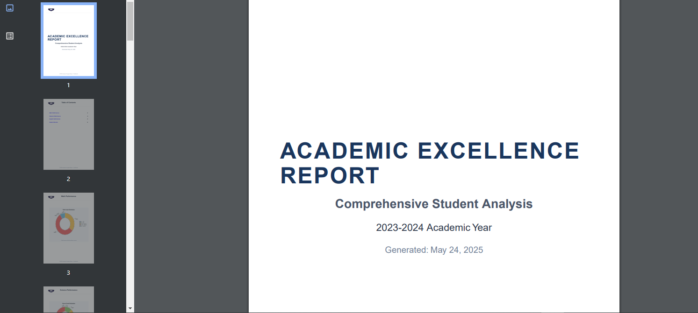

# Academic Performance Reporting System

A Next.js web application for generating comprehensive PDF reports of student academic performance with interactive charts and tables.



## Features

- **PDF Report Generation**: Generate detailed PDF reports with multiple sections
- **Data Visualization**: Interactive pie charts showing grade distributions
- **Dynamic Data Handling**: Load student data from JSON files
- **Responsive UI**: Material-UI based interface with loading states
- **Bookmarked PDF**: Navigable PDF with table of contents and anchors

## Technologies

- **Framework**: Next.js 14
- **UI Library**: React 18, Material-UI 5
- **PDF Generation**: @react-pdf/renderer
- **Charts**: ECharts 5 + Canvas
- **Type Safety**: TypeScript 5
- **Build Tool**: npm

## Installation

### Prerequisites
- Node.js v18+
- npm v9+

1. Clone repository:
```bash
git clone https://github.com/yourusername/academic-reporting-system.git
cd academic-reporting-system
